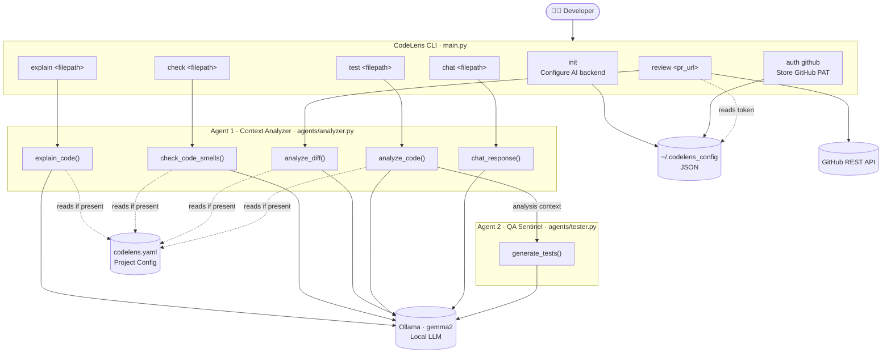
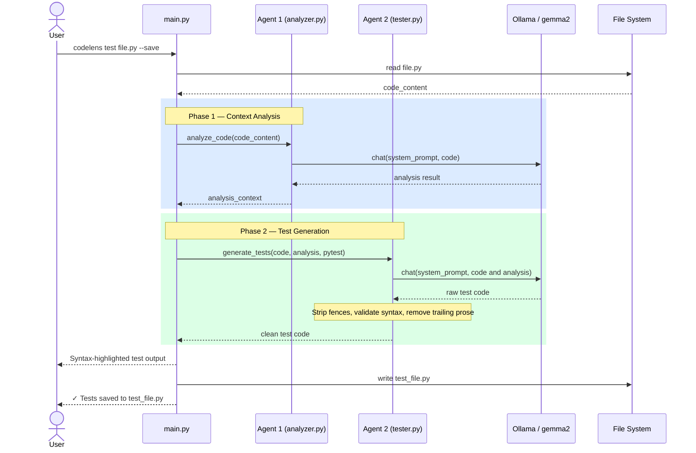
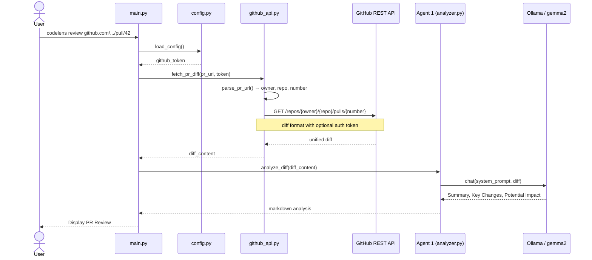

# 🔍 CodeLens: AI-Powered CLI Code Review & QA Assistant

## Application Description

**CodeLens** is an intelligent Command Line Interface (CLI) tool designed to accelerate the Code Review process and automate the writing of unit tests. Built for development teams and open-source maintainers, the application eliminates the time spent understanding legacy code and manually writing repetitive tests directly from your terminal.

The system allows users to analyze local code files or direct Pull Requests (via `git diff`). From that moment, our multi-agent AI architecture takes over:

- **Context Analyzer (The Explainer Agent)**: Parses the source code or PR changes and explains the business logic in natural language. It identifies potential "code smells" and documents what the code does step-by-step, providing the necessary context for any human reviewer.
- **QA Sentinel (The Tester Agent)**: Takes the original code PLUS the explanation generated by the Context Analyzer and automatically generates robust unit tests (e.g., in PyTest, Jest, or JUnit). Because of the context received from the first agent, QA Sentinel doesn't just write "happy path" tests; it identifies and covers edge cases.

---

## 🤖 AI Agent Architecture (Core Logic)

The CLI relies on a direct collaboration between two LLMs (which can run locally via Ollama, e.g., `Llama-3` or `Phi-3`, to ensure zero data leakage of proprietary code):
1. **Agent 1 (Analysis)**: `Input: Raw Code` ➡️ `Output: Logic Explanation + Code Smells (Structured CLI Output)`
2. **Agent 2 (Testing)**: `Input: Raw Code + Output from Agent 1` ➡️ `Output: Executable Unit Test Suite saved to disk`

---

## 📋 User Stories / Product Backlog

### Epic 1: Configuration and CLI Setup

**User Story 1.1: CLI Installation and Initial Setup**
- **Description**: As a developer, I want to install the tool easily and configure my preferred AI provider, so that I can start analyzing code immediately.
- **Acceptance Criteria**:
  - The user can install the CLI via a simple command (e.g., `pip install codelens-cli` or similar).
  - The command `codelens init` prompts the user to select the AI backend (OpenAI, Anthropic, or Local via Ollama).
  - Configurations are securely saved in a local `.codelens_config` file.

**User Story 1.2: Authenticating with GitHub (Optional)**
- **Description**: As a user analyzing Pull Requests, I want to authenticate the CLI with GitHub, so it can automatically fetch diffs from private repositories.
- **Acceptance Criteria**:
  - The command `codelens auth github` prompts the user for a GitHub Personal Access Token (PAT).
  - The token is securely stored locally and used for subsequent GitHub API calls.

---

### Epic 2: The Context Analyzer Agent (The Explainer)

**User Story 2.1: Local File Analysis**
- **Description**: As a reviewer, I want to run a command on a local file to get a clear summary of its logic.
- **Acceptance Criteria**:
  - Running `codelens explain <filepath>` triggers Agent 1.
  - The CLI outputs a structured summary (TL;DR, Major Components, Logic Flow) directly in the terminal, using colored formatting for readability.

**User Story 2.2: Pull Request Analysis**
- **Description**: As a maintainer, I want to pass a GitHub PR URL to the CLI to understand the changes before reviewing them online.
- **Acceptance Criteria**:
  - Running `codelens review <pr_url>` fetches the diff using the GitHub API.
  - Agent 1 analyzes the diff and outputs a summary of the changes and potential impact.

**User Story 2.3: Identifying Code Smells**
- **Description**: As a developer, I want the analyzer to warn me about bad practices or security issues in the specified file.
- **Acceptance Criteria**:
  - Running `codelens check <filepath>` prompts Agent 1 to look specifically for code smells.
  - The CLI outputs warnings with color codes (Yellow for Warning, Red for Critical) and line numbers.

---

### Epic 3: The QA Sentinel Agent (The Tester)

**User Story 3.1: Generating Happy Path Tests**
- **Description**: As a developer, I want the CLI to generate basic unit tests for my code using my preferred testing framework.
- **Acceptance Criteria**:
  - Running `codelens test <filepath> --framework pytest` triggers Agent 2 (which first waits for Agent 1 to provide the context).
  - The CLI outputs the generated tests in the terminal.

**User Story 3.2: Generating Edge Case Tests**
- **Description**: As a QA engineer, I want the agent to deduce and write tests for edge cases based on the logic analysis.
- **Acceptance Criteria**:
  - When the `codelens test` command is run, Agent 2 includes a distinct section in its output dedicated to edge cases/exception handling.
  - Each test includes a comment explaining *why* the test was created.

**User Story 3.3: Saving Generated Tests to Disk**
- **Description**: As a developer, I want the tool to automatically save the generated tests into a new file so I don't have to copy-paste from the terminal.
- **Acceptance Criteria**:
  - Adding the `--save` flag (e.g., `codelens test <filepath> --save`) writes the output to a new file (e.g., `test_<filename>.py` or `<filename>.spec.js`) in the appropriate directory.

---

### Epic 4: Advanced CLI Features

**User Story 4.1: Interactive Mode**
- **Description**: As a developer, I want an interactive chat mode in the terminal to ask follow-up questions about the code.
- **Acceptance Criteria**:
  - Running `codelens chat <filepath>` opens an interactive prompt.
  - The user can ask questions like "Why is this function returning null?" and Agent 1 replies based on the code context.

**User Story 4.2: Project-Wide Configuration File**
- **Description**: As a team lead, I want to define a `codelens.yaml` in the repository root to enforce specific instructions for the agents (e.g., "Always use Mockito for mocking").
- **Acceptance Criteria**:
  - If a `codelens.yaml` file exists in the current directory, the CLI reads it and appends the custom instructions to the agents' system prompts.

---

## 🧱 Architecture & Tech Stack

- **CLI Framework**: Python with `Typer` or `Click` (for building beautiful, robust terminal interfaces) and `Rich` (for colored terminal output and markdown rendering).
- **AI / LLM Integration**: `LangChain` or `LlamaIndex` to orchestrate the communication between Agent 1 and Agent 2.
- **Local AI Support**: Integration with `Ollama` for running models like Llama-3 locally, ensuring source code never leaves the developer's machine.

---

## 🗺 Architecture Diagrams

### System Architecture

### Multi-Agent Pipeline — `codelens test`

### Review Workflow — `codelens review`

---

## 🚀 AI-Assisted Software Development Process (MDS 2026 Requirements)

This project is developed adhering to the principles of *AI-Assisted Software Engineering*:

1. **Backlog & Requirements (2 pts)**: The user stories were structured and refined using AI assistants to ensure clear acceptance criteria.
2. **Code Generation**: The implementation relies heavily on AI coding assistants (GitHub Copilot / Cursor IDE) to accelerate the creation of CLI commands, API wrappers, and LLM integrations.
3. **Architecture Diagrams (1 pt)**: System architecture and agent workflows will be documented using Mermaid.js diagrams generated by AI.
4. **Automated Testing & Agent Evals (2 pts)**: 
   - The CLI logic itself will be covered by AI-generated unit tests.
   - **Crucial**: We will use an evaluation framework (e.g., *DeepEval* or *Promptfoo*) to write automated tests ("evals") for our agents. We will assert that Agent 1 consistently identifies a known bug in a dummy file, and that Agent 2 outputs syntactically valid Python code.
5. **CI/CD & Source Control (2 pts)**: We use GitHub Actions (configured with AI) for linting and running tests on every Pull Request. Every team member will use separate branches and clear commits (minimum 5 commits/student).
6. **Bug Tracking (1 pt)**: Bugs will be reported via GitHub Issues, utilizing AI to suggest fixes based on the error logs.
7. **AI Usage Report (2 pts)**: A comprehensive report will be provided detailing exactly which tools were used (Copilot, ChatGPT, Ollama) and how they impacted the development speed and code quality.∏
